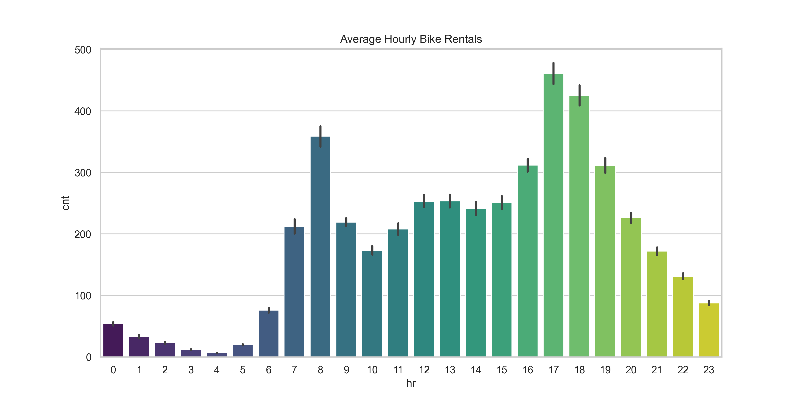
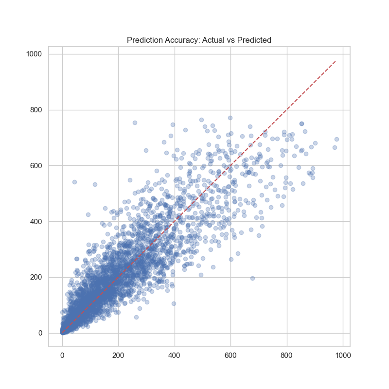

# 🚲 Bike Sharing Demand Prediction System
**Technical University of Dortmund - ITP Project**

## 📖 Project Overview
Predicting the demand for bike rentals is a complex challenge because it's influenced by both **environmental conditions** and **human behavior patterns**. 

This project uses Machine Learning to answer a critical business question: *How many bikes will be needed in a specific hour, given the weather and the day of the week?* By analyzing thousands of data points, we've built a system that helps bike-sharing providers optimize their fleet distribution, ensuring bikes are available when and where people need them most.

---

## 📊 About the Data
We utilized the **UCI Bike Sharing Dataset**, which contains hourly rental counts linked to:
* **Environmental Factors:** Temperature, Humidity, Windspeed, and Weather Situation (Clear, Misty, Rain/Snow).
* **Temporal Factors:** Hour of the day (0-23), Working Day vs. Holiday, and Seasons.

**Key Insight:** Our analysis proved that "Hour of the Day" is the most significant predictor, as demand spikes during morning and evening rush hours.

---

## 🚀 Evolution & Model Performance
The project evolved through rigorous testing:
1. **Baseline:** A Linear Regression model (Accuracy: ~25%). It failed because bike demand doesn't change "linearly" with time.
2. **Final Model:** A **Random Forest Regressor** (Accuracy: **93.77%**). This model excels at capturing the complex, non-linear interactions between weather and peak commuting hours.

---

## 🏗️ Technical Architecture & Challenges
* **Modular Design (OOP):** Organized into `main`, `model`, and `plotter` classes for clean, reusable code.
* **Interactive CLI:** Users can manually input conditions to get real-time predictions.
* **Git Mastery:** The project history reflects a journey of resolving complex **Merge Conflicts** and structural refactoring, showcasing professional version control skills.
* **AI Collaboration:** Built using a human-in-the-loop approach, where AI assisted in code optimization while the architectural logic and feature engineering were human-led.

---

## 📂 Data Source
Dataset provided by [Data Science Dojo / UCI Repository](https://code.datasciencedojo.com/datasciencedojo/datasets/tree/master/Bike%20Sharing).
---
## 🖼️ Preview of Analysis Results

---
**Author:** Kimia  Safaei,
*Dortmund, Germany - March 2026*
